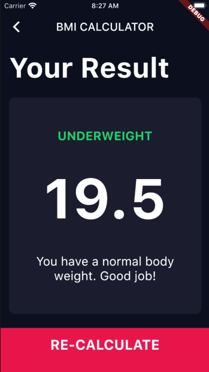

# BMI-Calculator-With-ChangeNotifier

# このプロジェクトについて
このプロジェクトは、Angela Yu さんの

[The Complete 2020 Flutter Development Bootcamp with Dart](https://www.udemy.com/course/flutter-bootcamp-with-dart/)

の動画レッスンで作成する [BMI Calculator](https://github.com/londonappbrewery/BMI-Calculator-Flutter-Completed) を ChangeNotifier を使用してリファクタしたものです。

[Mediumに本リポジトリに関する記事をアップしてあります](https://medium.com/@m_coder/flutter-bmi%E8%A8%88%E7%AE%97%E3%82%A2%E3%83%97%E3%83%AA%E3%82%92-setstate-%E3%81%8B%E3%82%89-provider-changenotifier-%E3%81%AB%E3%83%AA%E3%83%95%E3%82%A1%E3%82%AF%E3%82%BF%E3%81%97%E3%81%9F%E8%A9%B1-239d3d25ce23)ので、併せてご覧いただければと思います。

# About This Project
This project was started by Angela Yu's

[The Complete 2020 Flutter Development Bootcamp with Dart](https://www.udemy.com/course/flutter-bootcamp-with-dart/)

This is the [BMI Calculator](https://github.com/londonappbrewery/BMI-Calculator-Flutter-Completed) refactored using ChangeNotifier.

I've uploaded an article about this repository on Medium, so please [see it](https://medium.com/@m_coder/flutter-bmi%E8%A8%88%E7%AE%97%E3%82%A2%E3%83%97%E3%83%AA%E3%82%92-setstate-%E3%81%8B%E3%82%89-provider-changenotifier-%E3%81%AB%E3%83%AA%E3%83%95%E3%82%A1%E3%82%AF%E3%82%BF%E3%81%97%E3%81%9F%E8%A9%B1-239d3d25ce23).